# Controlling 3D Animations

In this chapter, we will cover:

1. Configuring a character's Avatar and idle animation

2. Moving your character with root motion and Blend Trees

3. Mixing animations with Layers and Masks

4. Organizing States into Sub-State Machines

5. Transforming the Character Controller via script

6. Adding rigid props to animated characters

7. Using Animation Events to throw an object

8. Applying Ragdoll physics to a character

9. Rotating the character's torso to aim a weapon

10. Creating geometry with Probuilder

11. Creating a game with the 3D Gamekit


<!-- ******************************** -->
<!-- ******************************** -->

# Introduction

The Mecanim animation system has revolutionized how characters are animated and controlled within Unity. In this chapter, we will learn how to take advantage of its flexibility, power, and friendly and highly visual interface.

<!-- ******************************** -->
<!-- ******************************** -->

# The big picture

Controlling a playable character with the Mecanim System might look like a complex task, but it is actually very straightforward.

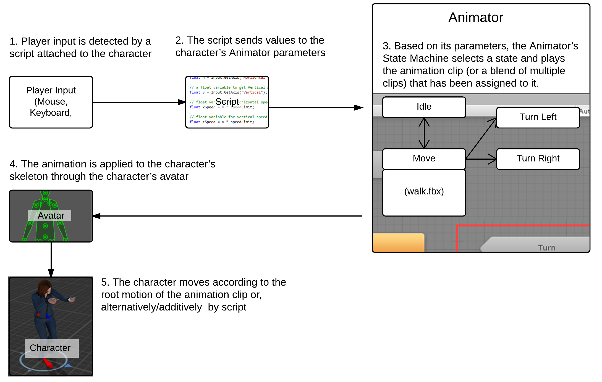

Hopefully, by the end of the chapter, you will have gained at least a basic understanding of the Mecanim system. For a more complete overview of the subject, consider taking a look at Jamie Dean's Unity Character Animation with Mecanim, also published by Packt Publishing.

An additional note—all the recipes will make use of Mixamo motion packs. Mixamo is a complete solution for character production, rigging, and animation. In fact, the character in use was designed with Mixamo's character creation software called Fuse, and rigged with the Mixamo Auto-rigger. You can find out more about Mixamo and their products at Unity's Asset Store (https://www.assetstore.unity3d.com/en/#!/publisher/150) or their website at https://www.mixamo.com/.

Please note that although Mixamo offers Mecanim-ready characters and animation clips, we will use, for the recipes in this chapter, unprepared animation clips. The reason is to make you more confident when dealing with assets obtained by other methods and sources.


<!-- ******************************* -->
<!-- ******************************* -->
<!-- ******** new recipe ********** -->
<!-- ******************************* -->
<!-- ******************************* -->

# Configuring a character's Avatar and idle animation

A feature that makes Mecanim so flexible and powerful is the ability of quickly reassigning animation clips from one character to another. This is made possible through the use of Avatars, which are basically a layer between your character's original rig and the Unity's Animator system.

In this recipe, we will learn how to configure an Avatar skeleton on a rigged character.

<!-- ******************************* -->
<!-- ******************************* -->

## Getting ready

For this recipe, you will need the MsLaser@T-Pose.fbx and Swat@rifle_aiming_idle.fbx files, which are provided in folder 09_03.

<!-- ******************************* -->
<!-- ******************************* -->

## How to do it...

To configure an Avatar skeleton, follow these steps:

1. Import the MsLaser@T-Pose.fbx and Swat@rifle_aiming_idle.fbx files to 
your project.

1. Select from the Project view, the MsLaser@T-Pose model.

1. In the Inspector view, under MsLaser@T-Pose Import Settings, activate the Rig section. Change Animation Type to Humanoid. Then, leave Avatar Definition as Create From this Model. Now click Apply to apply these settings. Finally, click on the Configure… button.

    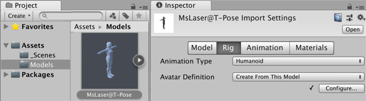

1. Inspector view will show the newly created Avatar. Observe how Unity correctly mapped the bones of our character into its structure, assigning, for instance, the mixamoRig:LeftForeArm bone as the Avatar's Lower Arm. We could, of course, reassign bones if needed. For now, just click on the Done button to close the view.

    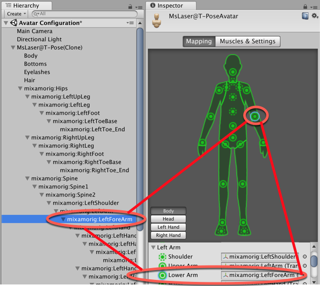

1. Now that we have our Avatar ready, let's configure our animation for the Idle state. From the Project view, select the Swat@rifle_aiming_idle file.


1. Select the Rig section, change Animation Type to Humanoid and leave Avatar Definition as Create From this Model. Confirm by clicking on Apply.

1. Select the Animations section (to the right of the Rig). The rifle_aiming_idle clip should be selected. Drag MsLaser@T-Pose to the Preview area at the bottom of the Inspector:

    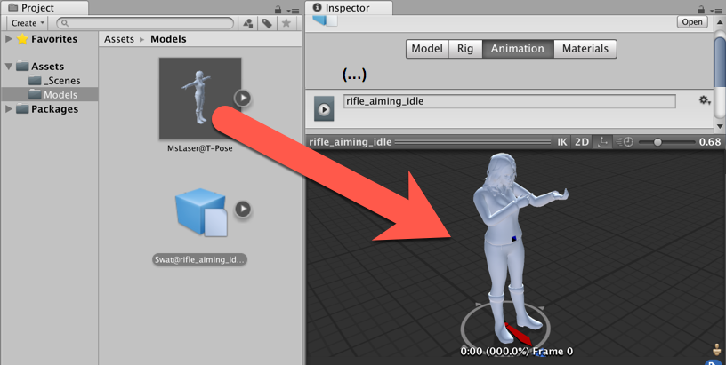

1. With rifle_aiming_idle selected from the Clips list, check the Loop Time and Loop Pose options. Also, click on the Clamp Range button to adjust the timeline to the actual time of the animation clip. Then, under Root Transform Rotation, check Bake Into Pose, and select Based Upon | Original. Under Root Transform Position (Y), check Bake Into Pose, and select Baked upon Original. Under Root Transform Position (XZ), leave Bake Into Pose unchecked, and select Based Upon (at Start) | Center of Mass. Finally, click on Apply to confirm the changes.

    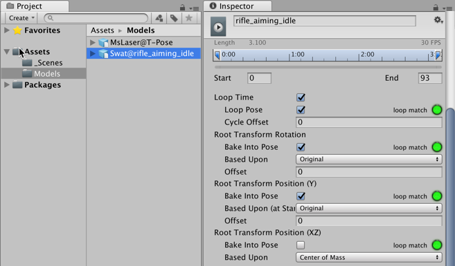

1. In order to access animation clips and play them, we need to create a controller. Do this by clicking on the Create button from the Project view, and then selecting the Animator Controller option. Name it as MainCharacter.

1. Double-click on the Animator Controller to open the Animator view.

1. From the Animator view, right-click on the grid to open a context menu. Then, select the Create State | Empty option. A new box named New State will appear. It will be in orange, indicating that it is the default state.

    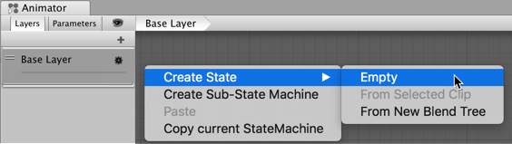

1. Select New State and, in the Inspector view, change its name to Idle. Also, in the Motion field, choose rifle_aiming_idle by either selecting it from the list or dragging it from the Project view.

    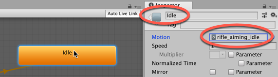

1. Drag the MsLaser@T-Pose model from the Project view into the Hierarchy view and place it on the scene.

1. Select MsLaser@T-Pose from the Hierarchy view and observe its Animator component in the Inspector view. Then, assign the newly created MainCharacter controller to its Controller field.

    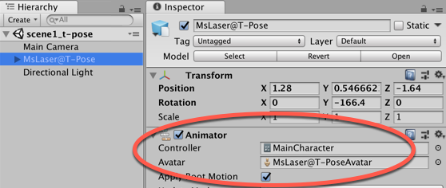

1. Play your scene to see the character correctly animated.

<!-- ******************************** -->
<!-- ******************************** -->

## How it works...

Preparing our character for animation took many steps. First, we created its Avatar, based on the character model's original bone structure. Then, we set up the animation clip (which, as the character mesh, is stored in a .fbx file), using its own Avatar. After this, we adjusted the animation clip, clamping its size and making it a loop. We also baked its Root Transform Rotation to obey the original file's orientation. Finally, an Animator Controller was created, and the edited animation clip was made into its default Animation state.

The concept of the Avatar is what makes Mecanim so flexible. Once you have a Controller, 
you can apply it to other humanoid characters, as long as they have an Avatar body mask.

<!-- ******************************** -->
<!-- ******************************** -->

## There's more...

Here are some ways to go further with this recipe.

<!-- ******************************** -->
<!-- ******************************** -->

## Use Controller with another 3D character Avatar

Let's swap MsLaser for a Mascot 3D character. Do the following:

1. Import the provided model mascot.fbx.

1. The apply steps 3 and 4 for this character to create its Avatar.

1. Drag an instance of the model into the Scene.

1. In the Inspector for its Animator Component, set the Controller to the MainCharacter Animator Controller you created in this recipe.

1. Run the Scene - you should see the mascot playing the rifle_aiming_idle animation clip.

<!-- ******************************** -->
<!-- ******************************** -->

## Further reading

To read more information about the Animator Controller, check out Unity's documentation at:

- http://docs.unity3d.com/Manual/class-AnimatorController.html


<!-- ******************************* -->
<!-- ******************************* -->
<!-- ******** new recipe ********** -->
<!-- ******************************* -->
<!-- ******************************* -->

# Moving your character with root motion and Blend Trees

The Mecanim animation system is capable of applying Root Motion to characters. In other words, it actually moves the character according to the animation clip, as opposed to arbitrarily translating the character model while playing an in-place animation cycle. This makes most of the Mixamo animation clips perfect for use with Mecanim.

Another feature of the animation system is Blend Trees, which can blend animation clips smoothly and easily. In this recipe, we will take advantage of these features to make our character walk/run forward and backwards, and also strafe right and left at different speeds.

<!-- ******************************* -->
<!-- ******************************* -->

## Getting ready

For this recipe, we have prepared a Unity package named Character_02, containing a character and featuring a basic Animator Controller. The package can be found inside the 09_02 folder, along with the FBX files for the animation clips you need.


<!-- ******************************* -->
<!-- ******************************* -->

## How to do it...

To apply the Root Motion to your character using Blend Trees, follow these steps:

1. Import Character_02.unityPackage into a new project. Also, import the follwing FBX files:

    - 
Swat@rifle_run, Swat@run_backwards, Swat@strafe, Swat@strafe_2, Swat@strafe_left, Swat@strafe_right, Swat@walking, and Swat@walking_backwards

1. We need to configure our animation clips. From the Project view, select 
Swat@rifle_run.

1. Activate the Rig section. Change Animation Type to Humanoid and Avatar Definition to Create From this Model. Confirm by clicking on Apply.

    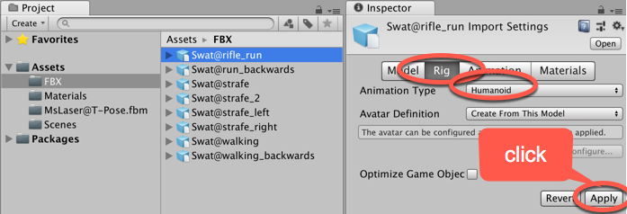

1. Now, activate the Animations section (to the right of Rig). Clip rifle_run should be selected. The Preview area (at the bottom of the Inspector view) will display the message as No model is available for preview. Drag MsLaser@T-Pose onto the Preview area.

1. With asset Swat@rifle_run still selected in the Project panel, in the Inspector check the Loop Time and Loop Pose options. Also, click on the Clamp Range button to adjust the timeline to the actual time of the animation clip. Click on Apply to confirm these changes.

    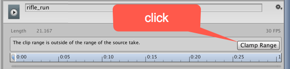

1. Then, under Root Transform Rotation, check Bake Into Pose, and select Based Upon | Original. Under Root Transform Position (Y), check Bake Into Pose, and select Based Upon (at Start) | Original. Under Root Transform Position (XZ), leave Bake Into Pose unchecked, and select Based Upon (at Start) | Center of Mass. Finally, click on Apply to confirm the changes.

    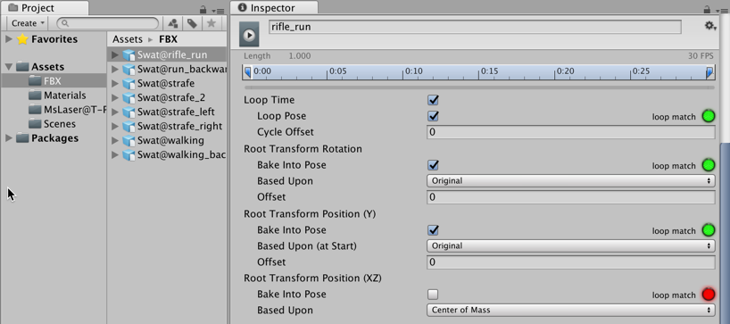

1. Repeat steps 3 to 6 for each one of the following animation clips: 
Swat@run_backwards, Swat@strafe, Swat@strafe_2, Swat@strafe_left, 
Swat@strafe_right, Swat@walking, and Swat@walking_backwards.

1. Add a 3D Plane to the Scene, choose menu: Create | 3D Object | Plane.

1. Drag an instance of the MsLaser prefab into the Scene, and position it on the 3D Plane.

1. From the Hierarchy view, select the MsLaser GameObject. In the Inspector add a Character Controller component to it (click Add Component and choose Component | Physics | Character Controller). Then, set its Skin Width as 0.0001, and its Center as X: 0, Y: 0.9, Z: 0; also change its Radius to 0.34 and its Height to 1.79.

    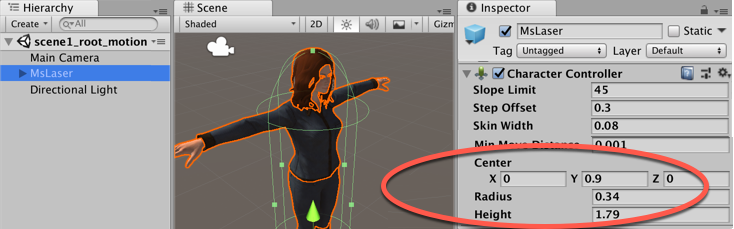

1. In the Project view, double click the MainCharacter controller asset file - it should open up in the Animator panel.

1. In the top-left corner of the Animator panel, activate the Parameters section and 
use the + sign to create three new Parameters (Float) named xSpeed, zSpeed, 
and Speed.

    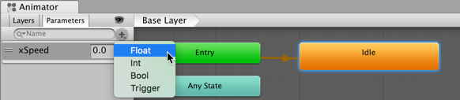

1. We do have an Idle state for our character, but we need the new ones. Right-click on the gridded area and, from the context menu, navigate to Create State | From New Blend Tree. In the Inspector change its name from the Default Blend Tree to Move.

    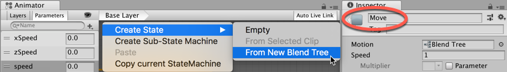

1. Double-click on the Move state. You will see the empty blend tree that you have created. Select it and, in the Inspector view, rename it to Move. Then, change its Blend Type to 2D Freeform Directional, also setting xSpeed and zSpeed in the Parameters tab. Finally, using the + sign from the bottom of the Motion list, add 
nine new Motion Fields.

    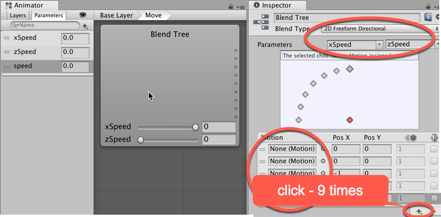

1. Now, populate the Motion list with the following motion clips and respective Pos X and Pos Y values: run_backwards, 0, -1; walking_backwards, 0,-0.5; rifle_aiming_idle, 0, 0; walking, 0, 0.5; rifle_run, 0, 1; strafe, -1, 0; strafe_left, -0.5, 0; strafe_right, 0.5, 0; strafe_2, 1, 0. You can populate the Motion list by selecting it from the list or, if there are more than one clip with the same name, you can drag it from the Project view onto the slot (by expanding the appropriate model icon).

    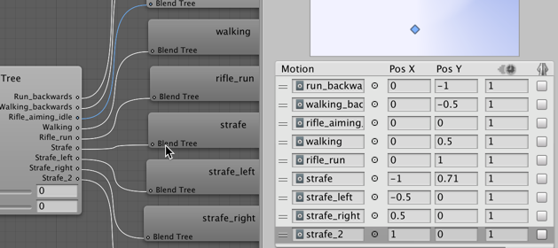

1. To return to 
Base Layer, either double-click on the gridded background of the Animator panel, or click the Base Layer button in the information bar along the top of the Animator panel:

    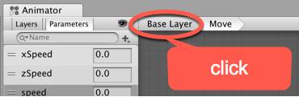

1. Since we have the rifle_aiming_idle Motion clip within our Move blend tree, we can get rid of the original Idle state. Right-click on the Idle state box and, from the menu, select Delete. The Move blend state will become the new default state, turning orange.

1. Now, we must create the script-class that will actually transform the player's input into those variables that are created to control the animation.

1. From the Project view, create a new C# Script and name it as BasicController.

1. Create a new C# script-class named BasicController, and add an instance-object as a component of GameObject MsLaser:

    ```csharp
        using UnityEngine;
        using System.Collections;

        public class BasicController: MonoBehaviour {
          private Animator anim;
          private CharacterController controller;
          public float transitionTime = .25f;
          private float speedLimit = 1.0f;
          public bool moveDiagonally = true;
          public bool mouseRotate = true;
          public bool keyboardRotate = false;

          void Start () {
            controller = GetComponent<CharacterController>();
            anim = GetComponent<Animator>();
          }

          void Update () {
            if(controller.isGrounded){
              if (Input.GetKey (KeyCode.RightShift) ||Input.GetKey (KeyCode.LeftShift))
                speedLimit = 0.5f;
              else
                speedLimit = 1.0f;

              float h = Input.GetAxis("Horizontal");
              float v = Input.GetAxis("Vertical");
              float xSpeed = h * speedLimit;
              float zSpeed = v * speedLimit;
              float speed = Mathf.Sqrt(h*h+v*v);

              if(v!=0 && !moveDiagonally)
                xSpeed = 0;

              if(v!=0 && keyboardRotate)
                this.transform.Rotate(Vector3.up * h, Space.World);

              if(mouseRotate)
                this.transform.Rotate(Vector3.up * (Input.GetAxis("Mouse X")) * Mathf.Sign(v), Space.World);

              anim.SetFloat("zSpeed", zSpeed, transitionTime, Time.deltaTime);
              anim.SetFloat("xSpeed", xSpeed, transitionTime, Time.deltaTime);
              anim.SetFloat("Speed", speed, transitionTime, Time.deltaTime);
            }
          }
        }
    ```
1. Play your scene and test the game. You should be able to control your character with the arrow keys (or WASD keys). Keeping the Shift key pressed will slow it down.

<!-- ******************************** -->
<!-- ******************************** -->

## How it works...

Whenever the BasicController script detects any directional keys in use, it sets the Speed variable of the Animator state to a value higher than 0, changing the Animator state from Idle to Move. The Move state, in its turn, blends the motion clips that it was populated with, according to the input values for xSpeed (obtained from Horizontal Axis input, typically A and D keys) and zSpeed (obtained from Vertical Axis input, typically W and S keys). Since Mecanim is capable of applying root motion to the characters, our character will actually move in the resulting direction.

For instance, if W and D keys are pressed, xSpeed and zSpeed values will rise to 1.0. From the Inspector view, it is possible to see that such combination will result in a blend between the motion clips called rifle_run and strafe_2, making the character run diagonally (front + right).

    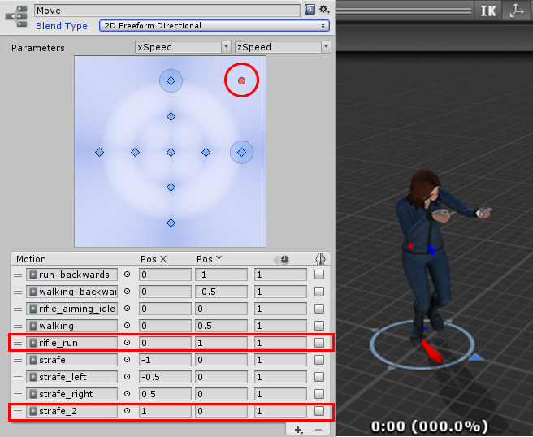

Our BasicController includes three checkboxes for more options: Move Diagonally—set as true, by default, which allows for blends between forward/backward and left/right clips; Mouse Rotate—set as true, by default, which allows for rotating the character with the mouse, changing their direction while moving; Keyboard Rotate—set as false, by default, which allows for rotating the character through simultaneous use of left/right and forward/backwards directional keys.


<!-- ******************************** -->
<!-- ******************************** -->

## There's more...

Here are some sources of futher learning about these topics.

Our blend tree used the 2D Freeform Directional Blend Type. However, if we had only four animation clips (forward, backwards, left, and right), 2D Simple Directional would have been a better option. Learn more on the following links:

Learn more about Blend Trees and 2D blending from Unity's Documentation at:

- http://docs.unity3d.com/Manual/BlendTree-2DBlending.html

Also, if you want to learn more about Mecanim Animation System, there are 
some links that you might want to check out, such as Unity's documentation at:

- http://docs.unity3d.com/Manual/AnimationOverview.html

Mecanim Example Scenes are available at Unity Asset Store at:

- 
https://www.assetstore.unity3d.com/en/#!/content/5328

Mecanim Video Tutorial are available at:

- http://unity3d.com/pt/learn/tutorials/topics/animation

<!-- ******************************* -->
<!-- ******************************* -->
<!-- ******** new recipe ********** -->
<!-- ******************************* -->
<!-- ******************************* -->

# Mixing animations with Layers and Masks

Mixing animations is a great way of adding complexity to your animated characters without requiring a vast number of animated clips. Using Layers and Masks, we can combine different animations by playing specific clips for the specific body parts of the character. In this recipe, we will apply this technique to our animated character, triggering animation clips for firing a rifle, and throwing a grenade with the character's upper body. We will do this while keeping the lower body moving or idle, according to the player's input.

<!-- ******************************* -->
<!-- ******************************* -->

## Getting ready

For this recipe, we have prepared a Unity Package named Mixing, containing a basic scene that features an animated character. We have also provided FBX animation clips Swat@firing_rifle.fbx and Swat@toss_grenade.fbx. All these files can be found in the 09_03 folder.

<!-- ******************************* -->
<!-- ******************************* -->

## How to do it...

To mix animations using layers and masks, follow these steps:

1. Create a new 3D project and import: the Mixing Unity Package, and also FBX files Swat@firing_rifle.fbx and Swat@toss_grenade.fbx.

1. Then, from the Project panel, open the mecanimPlayground level.

1. We need to configure the Animation Clips. Select 
asset Swat@firing_rifle in the Project panel.

1. Select the Rig section. Change Animation Type to Humanoid, and Avatar Definition to Create From this Model. Confirm this by clicking on Apply.

    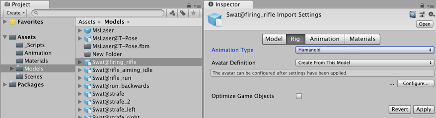

1. Now, activate the Animations section. Select the firing_rifle clip (from the Clips list), click on the Clamp Range button to adjust the timeline, and check the Loop Time and Loop Pose options. Under Root Transform Rotation, check Bake Into Pose, and select Based Upon | Original. Under Root Transform Position (Y), check Bake Into Pose, and select Based Upon (at Start) | Original. Under Root Transform Position (XZ), leave Bake Into Pose unchecked. Click on Apply to confirm the changes.

    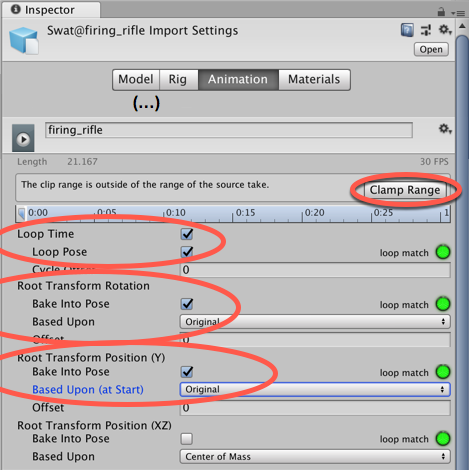

1. Select the Swat@toss_grenade animation clip. Activate the Rig section. Then, change Animation Type to Humanoid, and Avatar Definition to Create From this Model. Confirm it by clicking on Apply.

1. Now, activate the Animations section. The toss_grenade animation clip should be selected. Click on the button Clamp Range to adjust the timeline, and leave the Loop Time and Loop Pose options unchecked. Under Root Transform Rotation, check Bake Into Pose, and select Based Upon | Original. Under Root Transform Position (Y), check Bake Into Pose, and select Based Upon (at Start) | Original). Under Root Transform Position (XZ), leave Bake Into Pose unchecked. Click on Apply to confirm the changes.

1. Let's create a Mask. From the Project view, click on the Create button and add an Avatar Mask to the project. Name it as BodyMask.

1. Select the BodyMask tab and, in the Inspector view, expand the Humanoid section. Green body sections and IK spots are selected (all are by default), and red are unselected. De-select the character's two legs, the circle base the feet are standing on, and the two feet IK spots (they should turn red):

    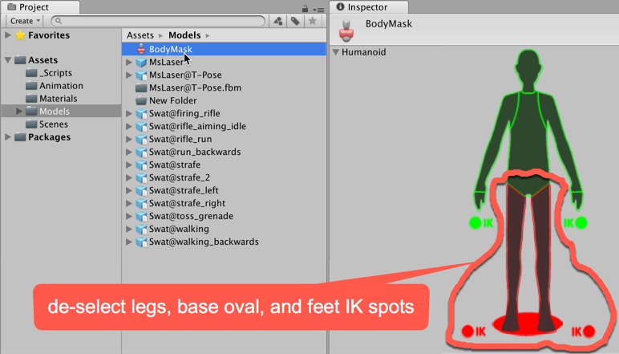

1. From the Hierarchy view, select the MsLaser character. Then, from the Animator component in the Inspector view, double-click on the MainCharacter controller to open it.

1. In the Animator view, create a new layer by clicking on the + sign at the top-left Layers tab, above the Base Layer.

1. Name the new layer as UpperBody and click on the gear icon for the settings. Then, change its Weight to 1, and select the BodyMask in the Mask slot. Also, change Blending to Additive.

    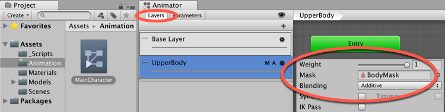

1. Now, in the Animator view, with the UpperBody layer selected, create three new empty states (by right-clicking on the gridded area and navigating to, from the menu, Create State | Empty). Name the default (orange) state null, and the other two as Fire and Grenade.

1. Now, access the Parameters tab and add two new parameters of the Bool type: Fire and Grenade.

    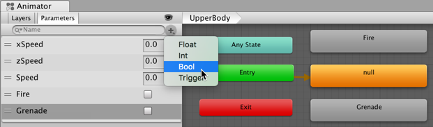

1. Select the Fire state and, in the Inspector view, add the firing_rifle animation clip to the Motion field.

    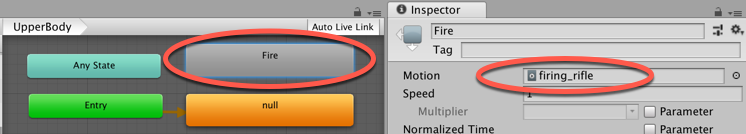

1. Now, select the Grenade state and, in the Inspector view, add the toss_grenade animation clip to the Motion field.

1. Right-click on the null state box and, from the menu, select Make Transition. Then, drag the white arrow onto the Fire box.

1. Select the arrow (it will turn blue). From the Inspector view, uncheck the Has Exit Time option. Then, access the Conditions list, click on the + sign to add a new condition, and set it as Fire and true.

    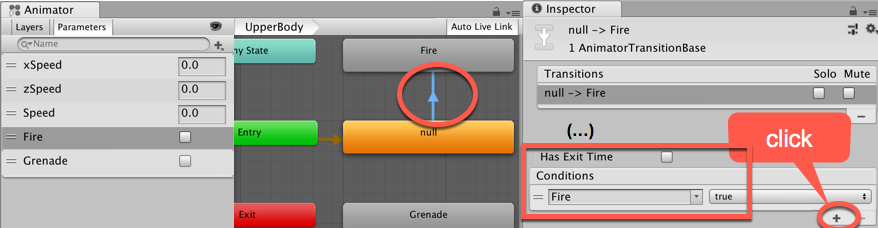

1. Now, make a transition from null to Grenade. Select the arrow (it will turn blue). From the Inspector view, uncheck the Has Exit Time option. Then, access the Conditions list, click on the + sign to add a new condition, and set it as Grenade and true.

1. Now, create transitions from Fire to null, and from Grenade to null. Then, select the arrow that goes from Fire to null and, in the Conditions box, select the Fire and false options. Leave the Has Exit Time option checked.

1. Finally, select the arrow that goes from Grenade to null. In the Conditions box, select the options Grenade, false. Leave the Has Exit Time option checked.

    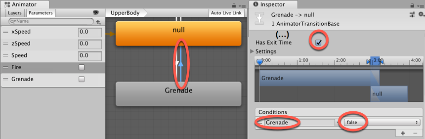

1. Open C# script-class Basic Controller in your code editor (folder Project | Scripts). Immediately before the end of the Update() function, add the following code:

    ```csharp
          if(Input.GetKeyDown(KeyCode.F)){
            anim.SetBool("Grenade", true);
          } else {
            anim.SetBool("Grenade", false);
          }

          if(Input.GetButtonDown("Fire1")){
            anim.SetBool("Fire", true);
          }

          if(Input.GetButtonUp("Fire1")){
            anim.SetBool("Fire", false);
          }
    ```

1. Save the script and play your Scene. You will be able to trigger the firing_rifle and toss_grenade animations by clicking on the fire button and pressing the F key. Observe how the character's legs still respond to the Move animation state - e.g. keep walking backwards while throwing the grenade.

<!-- ******************************** -->
<!-- ******************************** -->

## How it works...

Once the Avatar mask is created, it can be used as a way of filtering the body parts that would actually play the animation states of a particular layer. In our case, we have constrained our fire_rifle and toss_grenade animation clips to the upper body of our character, leaving the lower body free to play the movement-related animation clips, such as walking, running, 
and strafing.


<!-- ******************************** -->
<!-- ******************************** -->

## There's more...

Here are some ways to go further with this recipe.

<!-- ******************************* -->
<!-- ******************************* -->

## Overide vs Additive blending

You might have noticed that the UpperBody layer has a parameter named Blending, which we have set to Additive. This means that animation states in this layer will be added to the ones from the lower layers. If changed to Override, the animation from this would override animation states from the lower layers when played. In our case, Additive helped in keeping the aim stable when firing while running.

For more information on Animation Layers and Avatar Body Masks, check out Unity's documentation at:

    - http://docs.unity3d.com/Manual/AnimationLayers.html

    - http://docs.unity3d.com/Manual/class-AvatarMask.html

<!-- ******************************* -->
<!-- ******************************* -->
<!-- ******** new recipe ********** -->
<!-- ******************************* -->
<!-- ******************************* -->

# Organizing States into Sub-state Machines

Whenever the Animator area gets too cluttered, you can always think of organizing your Animation States into Sub-State Machines. In this recipe, we will use this technique to organize animation states for turning the character. Also, since the provided animation clips do not include Root Motion, we will use the opportunity to illustrate how to overcome the lack of Root Motion via script, using it to turn the character 45 degrees to the left and right.

    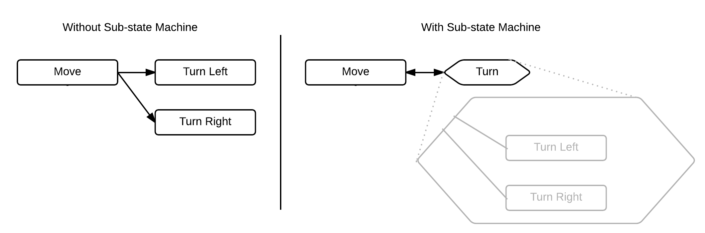

<!-- ******************************* -->
<!-- ******************************* -->

## Getting ready

For this recipe, we have prepared a Unity Package named Turning, containing a basic scene that features an animated character. We have also provided FBX animation clips Swat@turn_right_45_degrees.fbx and 
Swat@turn_left.fbx. All these files can be found in the 09_04 folder.

<!-- ******************************* -->
<!-- ******************************* -->

## How to do it...

To organize States into Sub-state Machines please follow these steps:

1. Create a new 3D project and import: the Mixing Unity Package, and also FBX files Swat@turn_right_45_degrees.fbx and Swat@turn_left.fbx.

1. Then, from the Project panel, open the mecanimPlayground level.

1. We need to configure the Animation Clips. Select 
asset Swat@turn_left in the Project panel.

1. Choose the Rig section. Change Animation Type to Humanoid, and Avatar Definition to Create From this Model. Confirm by clicking on Apply.

1. Now, choose the Animations section. The turn_left clip should be selected. Click on the Clamp Range button to adjust the timeline, and check the Loop Time option. Under Root Transform Rotation, check Bake Into Pose, and navigate to Based Upon | Original. Under Root Transform Position (Y), check Bake Into Pose, and select Based Upon (at Start) | Original. Under Root Transform Position (XZ), leave Bake Into Pose unchecked. Click on Apply to confirm the changes.

    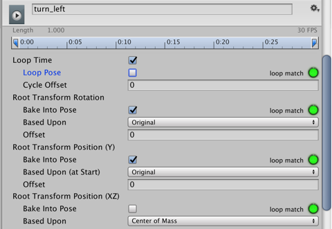

1. Repeat steps 4 and 5 for Swat@turning_right_45_degrees.

1. In the Project panel, double click the MainCharacter controller asset file - it should open up in the Animator panel.

1. From the top-left corner of the Animator view, select the Parameters section and use the + sign to create the two new Parameters (Boolean) named TurnLeft and TurnRight.

1. Right-click on the gridded area. From the context menu, select Create Sub-State Machine. From the Inspector view, rename it Turn.

    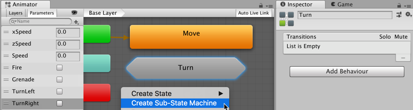

1. Double-click on the Turn sub-state machine. Right-click on the gridded area, select Create State | Empty, and add a new state. Rename it to Turn Left. Then, add another state named Turn Right.

1. From the Inspector view, populate Turn Left with the turn_left motion clip. Then, populate Turn Right with turning_right_45_degrees.

    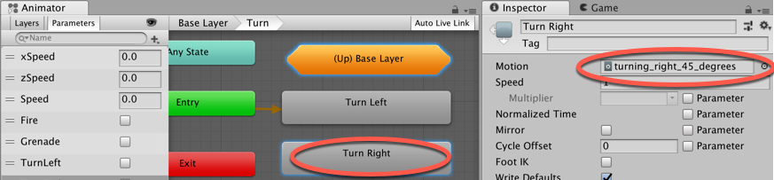

1. In the Animator panel return to the Base Layer (click Base Layer in information bar along the top of this panel).

By right-clicking on each state and selecting the option Make Transition,

1. Create 2 Transitions from State Move. One into sub-state Turn Left, and one into sub-state Turn Right.

    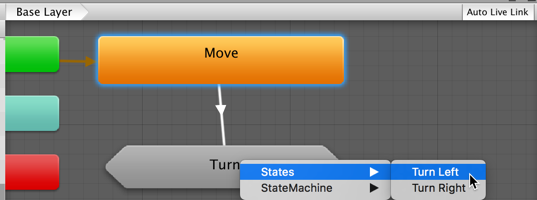

1. Create 2 return Transition:from sub-state Turn Left back to Move, and from sub-state Turn Right back to Move. Do this by entering the sub-state Turn, and dragging Transition arrows from Turn Left and Turn Right into (Up) Base Layer, and choosing State Move.

1. Select the arrow that goes form Turn Right to (Up) Base Layer. It will turn blue. From the Inspector view, uncheck the Has Exit Time option. Then, access the Conditions list, click the + sign to add a new condition, and set it as TurnRight and false.

    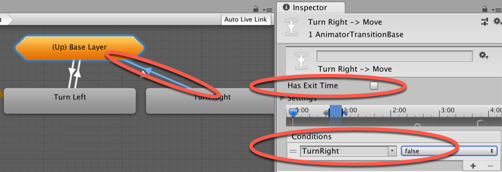

1. Select the arrow that goes from (Up) Base Layer to Turn Right. From the Inspector view, uncheck the Has Exit Time option. Then, access the Conditions list, click the + sign to add a new condition, and set it as TurnRight and true.

1. Repeat steps 14 and 15 with the arrows that go between (Up) Base Layer and Turn Left, using TurnLeft as a condition, this time.

1. Open C# script-class Basic Controller in your code editor (folder Project | Scripts). Immediately after the if(controller.isGrounded){ line, add:

    ```csharp
        if(Input.GetKey(KeyCode.Q)){
          anim.SetBool("TurnLeft", true);
          transform.Rotate(Vector3.up * (Time.deltaTime * -45.0f), 
Space.World);
        }  else {
          anim.SetBool("TurnLeft", false);
        }

        if(Input.GetKey(KeyCode.E)){
          anim.SetBool("TurnRight", true);
          transform.Rotate(Vector3.up * (Time.deltaTime * 45.0f), Space.World);
        } else {
          anim.SetBool("TurnRight", false);
        }
    ```

1. Save your script. Then, select the MsLaser character and, from the Inspector view, access the Basic Controller component. Leave the Move Diagonally and Mouse Rotate options unchecked. Also, leave the Keyboard Rotate option checked. Finally, play the scene. You will be able to turn left and right by using the Q and E keys, respectively.

<!-- ******************************** -->
<!-- ******************************** -->

## How it works...

As it should be clear from the recipe, the sub-state machines work in a similar way to groups or folders, allowing you to encapsulate a series of state machines into a single entity for easier reference. States from the sub-state machines can be transitioned from external states, in our case, the Move state, or even from different sub-state machines.

Regarding the character's rotation, we have overcome the lack of root motion by using the transform.Rotate(Vector3.up * (Time.deltaTime * -45.0f), Space.World); command to make the character actually turn around when the Q and E keys are being held down. This command was used in conjunction with animator.SetBool("TurnLeft", true);, which triggers the right animation clip.

    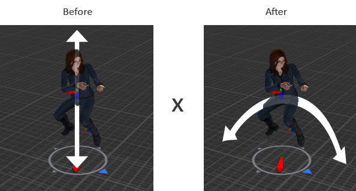

<!-- ******************************* -->
<!-- ******************************* -->
<!-- ******** new recipe ********** -->
<!-- ******************************* -->
<!-- ******************************* -->

# Transforming the Character Controller 
via script

Applying Root Motion to your character might be a very practical and accurate way to animate it. However, every now and then, you might need to manually control one or two aspects of the character movement. Perhaps you only have an in-place animation to work with, or maybe you want the character's movement to be affected by other variables. In these cases, you will need to override the root motion via script.

To illustrate this issue, this recipe makes use of an animation clip for jumping, which originally moves the character only in the Y-axis. In order to make her move forward or backwards while jumping, we will learn how to access the character's velocity to inform the jump's direction via the script.

<!-- ******************************* -->
<!-- ******************************* -->

## Getting ready

For this recipe, we have prepared a Unity Package named Jumping, containing a basic scene that features an animated character. We have also provided FBX animation clip Swat@rifle_jump. All these files can be found in the 09_05 folder.

<!-- ******************************* -->
<!-- ******************************* -->

## How to do it...

To apply the Root Motion via script, please follow these steps:

1. Create a new 3D project and import: the Jumping Unity Package, and also FBX file Swat@rifle_jump.fbx.

1. Then, from the Project panel, open the mecanimPlayground level.

1. We need to configure the Animation Clips. Select 
asset Swat@rifle_jump in the Project panel.

1. Select the Rig section. Change Animation Type to Humanoid, and Avatar Definition to Create From this Model. Confirm this by clicking on Apply.

1. Now, activate the Animations section. The rifle_jump clip should be selected. Click on the Clamp Range button to adjust the timeline, and check the Loop Time and Loop Pose options. Under Root Transform Rotation, check Bake Into Pose, and select Based Upon | Original. Under Root Transform Position (Y), leave Bake into Pose unchecked, and select Based Upon (at Start) | Original. Under Root Transform Position (XZ), leave Bake Into Pose unchecked. Click on Apply to confirm the changes.

    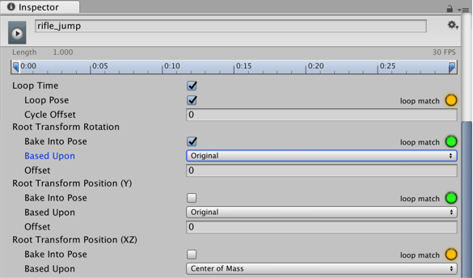

1. In the Project panel, double click the MainCharacter controller asset file - it should open up in the Animator panel.

1. From the top-left corner of the Animator view, select the Parameters section, and use the + sign to create a new Parameters (Bool) named Jump.

1. Add a new State named Jump. Do this by right-clicking the gridded area and chosing menu: Create State | Empty, then changing its name in the Inspector.

    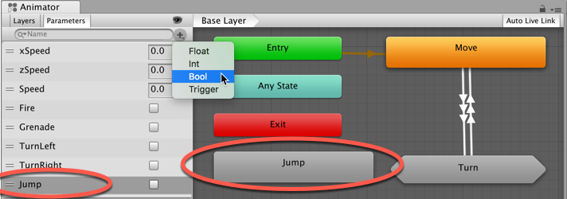

1. Select the Jump state. Then, from the Inspector view, populate it with the rifle_jump Motion clip.

    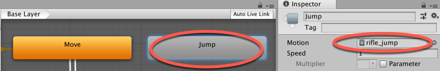

1. Create a Transition from Any State to Jump (using right-mouse-click menu Make Transition). Select the transition, uncheck Has Exit Time, and add a Condition for when Jump is true.

    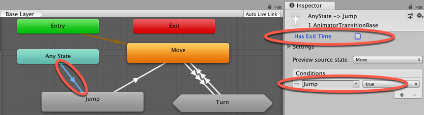

1. Now, create a transition from Jump to Move. Leaving Has Exit Time checked, and add a Condition for when Jump is false.

    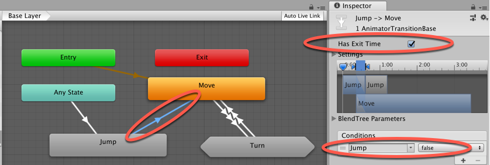

1. Open C# script-class Basic Controller in your code editor (folder Project | Scripts).

1. Right before the Start() function, add the following code:

    ```csharp
        public float jumpHeight = 3f;
        private float verticalSpeed = 0f;
        private float xVelocity = 0f;
        private float zVelocity = 0f;
    ```

1.  Immediately after the if(controller.isGrounded) line, add:

    ```csharp
        if (Input.GetKey (KeyCode.Space)) {
          anim.SetBool ("Jump", true);
          verticalSpeed = jumpHeight;
        }
    ```

1. Finally, add a new function, following immediately before the final } of the code:

    ```csharp
          void OnAnimatorMove(){
            Vector3 deltaPosition = anim.deltaPosition;
            if (controller.isGrounded) {
              xVelocity = controller.velocity.x;
              zVelocity = controller.velocity.z;
            } else {
              deltaPosition.x = xVelocity * Time.deltaTime;
              deltaPosition.z = zVelocity * Time.deltaTime;
              anim.SetBool ("Jump", false);
            }
            deltaPosition.y = verticalSpeed * Time.deltaTime;
            controller.Move (deltaPosition);
            verticalSpeed += Physics.gravity.y * Time.deltaTime;
            if ((controller.collisionFlags & CollisionFlags.Below) 
!= 0) {
              verticalSpeed = 0;
            }
          }
    ```

1. Save your script and play the scene. You will be able to jump around using the Space key. Observe how the character's velocity affects the direction of the jump.

<!-- ******************************** -->
<!-- ******************************** -->

## How it works...

Observe that once this function is added to the script, the Apply Root Motion field, in the Animator component, changes from a checked box to Handled by Script.

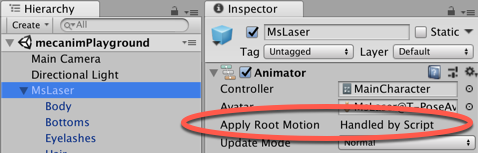

The reason is that in order to override the animation clip's original movement, we have placed, inside Unity's OnAnimatorMove() function, a series of commands to move our character controller while jumping. The line of code: controller.Move (deltaPosition); basically replaces the jump's direction from the original animation with the deltaPosition 3D Vector, which is made of the character's velocity at the instant before the jump (x and z-axis) and the calculation between the jumpHeight variable and gravity force overtime (y-axis).

<!-- ******************************* -->
<!-- ******************************* -->
<!-- ******** new recipe ********** -->
<!-- ******************************* -->
<!-- ******************************* -->

# Adding rigid props to animated characters

In case you haven't included a sufficient number of props to your character when modeling and animating it, you might want to give her the chance of collecting new ones at runtime. In this recipe, we will learn how to instantiate a GameObject and assign it to a character, respecting the animation hierarchy.

<!-- ******************************* -->
<!-- ******************************* -->

## Getting ready

For this recipe, we have prepared a Unity Package named Props, containing a basic scene that features an animated character, and prefab named badge. There is also a Texture named texture_pickupBadge.png. The files can be found in the 09_06 folder.

<!-- ******************************* -->
<!-- ******************************* -->

## How to do it...

To add a rigid prop at runtime to an animated character, follow these steps:

1. Create a new 3D project and import: the Props Unity Package, and Texture texture_pickupBadge.png.

1. Then, from the Project panel, open the mecanimPlayground level.

1. From the Project panel, add the badge prop to the scene by dragging it onto the Hierarchy view.

1. Make badge a child of the mixamorig:Spine2 Transform (use the Hierarchy tree to navigate to MsLaser | mixamorig:Hips | mixamorig:Spine | mixamorig:Spine1 | mixamorig:Spine2). Then, make the badge object visible above the character's chest by changing its Transform Position to X: -0.08, Y: 0, Z: 0.15; and Rotation to X: 0.29, Y: 0.14, Z:-13.29.

    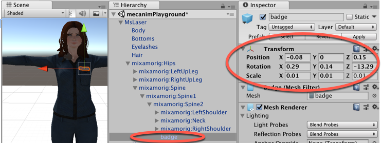

1. Make a note of the Position and Rotation values, and delete the badge object from the scene.

1. Add a 3D Cube named Cube-pickup to the Scene, by choosing menu: Create | 3D Object | Cube. In the Inspector set its Transform Position to (0, 0.5, 2); and check the Is Trigger option for the Box Collider component.

1. Drag Texture texture_pickupBadge.png from the Project panle onto GameObject Cube-pickup. So you should see the text Pickup Badge written on all sides of the Cube.

1. In the Project panel, create a new C# script-class named AddProp.cs containing the following code, and add an instance-object as a component to GameObject Cube-pickup:

    ```csharp
        using UnityEngine;
        using System.Collections;

        public class PropManager : MonoBehaviour  {
        	public GameObject prop;
        	public Transform targetBone;
        	public Vector3 positionOffset;
        	public Vector3 rotationOffset;
        	public bool destroyTrigger = true;

        	void OnTriggerEnter(Collider collision) {
        		bool addPropCondition = targetBone.IsChildOf(collision.transform) & !AlreadyHalreadyHasChildObject();

        		if (addPropCondition)
        			AddProp();
        	}

        	private void AddProp() {
        		GameObject newprop;
        		newprop = Instantiate(prop, targetBone.position, targetBone.rotation) as GameObject;
        		newprop.name = prop.name;
        		newprop.transform.parent = targetBone;
        		newprop.transform.localPosition += positionOffset;
        		newprop.transform.localEulerAngles += rotationOffset;

        		if(destroyTrigger)
        			Destroy(gameObject);
        	}

        	private bool AlreadyHalreadyHasChildObject() {
        		string propName = prop.name;

        		foreach(Transform child in targetBone){
        			if (child.name == propName)
        				return true;
        		}

        		return false;
        	}
        }
    ```

1. Select GameObject Cube-pickup, and look at the properties of the Prop Manager (Script) component in the Inspector. Populate the public variables as follows:

    - Prop: the badge prefab

    - Target Bone: the mixamorig:Spine2 transform inside Hierarchy GameObject MsLaser

    - Position Offset: (-0.08, 0, 0.15)

    - Rotation Offset: (0.29, 0.14, -13.29)

    - Destroy Trigger: checked (true)

    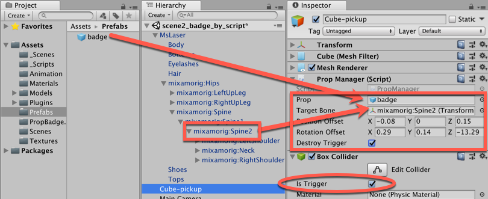

1. Run the scene. Using the 'WASD' keyboard control scheme, direct the character to the GameObject Cube-pickup. Colliding with it will add a badge to the character (the first time). If you checked Destroy Trigger then Destroy Trigger GameObject Cube-pickup should be removed from the Scene after the first collision.

    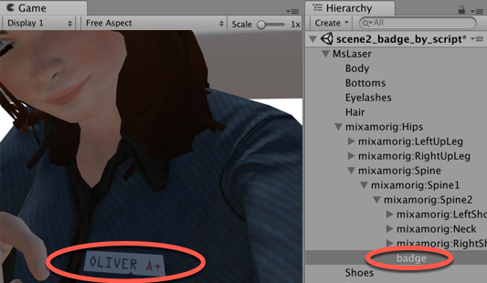

<!-- ******************************** -->
<!-- ******************************** -->

## How it works...

Once it's been triggered by the character, the scripted instance-object attached to GameObject Cube-pickup instantiates the assigned prefab, making it a child of the bones that they have been "placed into". The Position Offset and Rotation Offset can be used to fine-tune the exact position of the prop (relative to its parent transform). As the props become parented by the bones of the animated character, they will follow and respect its hierarchy and animation.

Method AlreadyHalreadyHasChildObject() checks for the preexisting props of the same name before actually instantiating a new one, so we don't attempt to Instantiate the prop more than once as a new child of the target bone.


<!-- ******************************** -->
<!-- ******************************** -->

## There's more...

Here are some ways to go further with this recipe.

<!-- ******************************** -->
<!-- ******************************** -->

## Removing props with a script

You can make a similar script to remove the props. In this case, the OnTriggerEnter(...) method would invoke the following RemoveProp() method:

```csharp
    private void RemoveProp() {
        string propName = prop.name;

        foreach(Transform child in targetBone){
            if (child.name == propName)
                Destroy (child.gameObject);
        }
    }
```


<!-- ******************************** -->
<!-- ******************************** -->

## Set Active if only one type of Prop

If there will only be one prop, then rather than having code Instantiate a new GameObject, you could have the prop always in the Hierarchy, but initially it is not active, and then when the pickup Trigger object is hit, you then change the prop GameObject to be active.

Although less flexible, it's a much simple script. Do the following:

1. Drag the badge Prefab at make a child of mixamorig:Spine2 Transform, and set Position and Rotation as you did in Step 4 of the recipe above.

1. In the Inspector, uncheck the Active checkbox for the whole badge GameObject (at the top of the Inspector).

1. Replace the content of C# script-manager with the following code:

    ```csharp
        using UnityEngine;

        public class PropManager : MonoBehaviour {
        	public GameObject propObject;

        	void OnTriggerEnter(Collider hit) {
        		if (hit.CompareTag("Player")) {
        			propObject.SetActive(true);
        			Destroy(gameObject);
        		}
        	}
        }
    ```

1. With GameObject Cube-pickup selected in the Hierarchy, in the Inspector drag the badge child of mixamorig:Spine2 into the public slot for the Prop Object variable, of component Prop Manager (Script).

<!-- ******************************* -->
<!-- ******************************* -->
<!-- ******** new recipe ********** -->
<!-- ******************************* -->
<!-- ******************************* -->

# Using Animation Events to throw an object

Now that your animated character is ready, you might want to coordinate some of her actions with her animation states. In this recipe, we will exemplify this by making the character throw an object whenever the appropriate animation clip reaches the right time. To do so, we will make use of Animation Events, which basically trigger a function from the animation clip's timeline. This feature, recently introduced to the Mecanim system, should feel familiar to those experienced with the Add Event feature of the classic Animation panel.

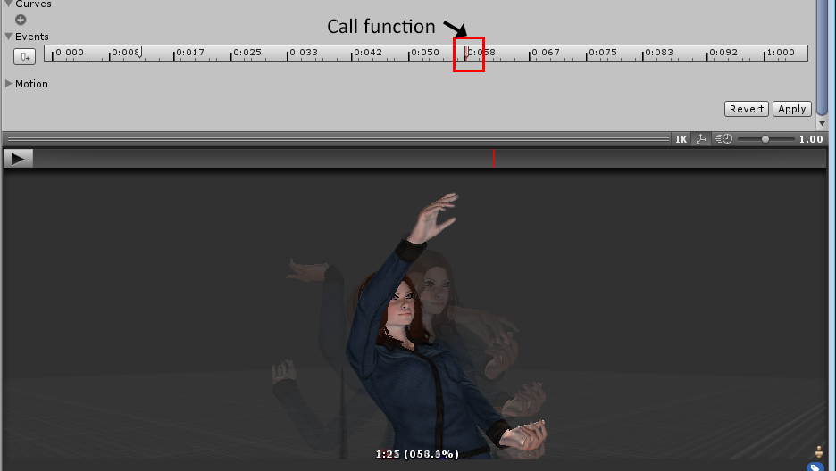

<!-- ******************************* -->
<!-- ******************************* -->

## Getting ready

For this recipe, we have prepared a Unity Package named Throwing, containing a basic scene that features an animated character, and prefab named EasterEgg. The files can be found in the 09_07 folder.

<!-- ******************************* -->
<!-- ******************************* -->

## How to do it...

To make an animated character throw an Easter egg (!), follow these steps:

1. Create a new 3D project and import: the Props Unity Package, and Texture texture_pickupBadge.png.

1. Open the mecanimPlayground level.

1. Play the level and press F on your keyboard. The character will move as if she is throwing something with her right hand.

1. Create a new C# script-class named ThrowObject.cs, and add an instance-object as a component to the character's GameObject named MsLaser:

    ```csharp
        using UnityEngine;
        using System.Collections;

        public class ThrowObject : MonoBehaviour {
          public GameObject prop;
          private GameObject proj;
          public Vector3 posOffset;
          public Vector3 force;
          public Transform hand;
          public float compensationYAngle = 0f;

          public void Prepare () {

            proj = Instantiate(prop, hand.position, hand.rotation) as GameObject;
            if(proj.GetComponent<Rigidbody>())
              Destroy(proj.GetComponent<Rigidbody>());
            proj.GetComponent<SphereCollider>().enabled = false;
            proj.name = "projectile";
            proj.transform.parent = hand;
            proj.transform.localPosition = posOffset;
            proj.transform.localEulerAngles = Vector3.zero;
          }

          public void Throw () {

            Vector3 dir = transform.rotation.eulerAngles;
            dir.y += compensationYAngle;
            proj.transform.rotation = Quaternion.Euler(dir);
            proj.transform.parent = null;
            proj.GetComponent<SphereCollider>().enabled = true;
            Rigidbody rig = proj.AddComponent<Rigidbody>();
            Collider projCollider = proj.GetComponent<Collider> ();
            Collider col = GetComponent<Collider> ();
            Physics.IgnoreCollision(projCollider, col);
            rig.AddRelativeForce(force);
          }
        }
    ```

1. In the Hierarchy, ensure the MsLaser GameObject is selected. In Inspector examine its Throw Object (Script) component. Populate the following:

    - Prop: the EasterEggp refab

    - Hand:  mixamorig:RightHand

    - Pos Offset: set to (0; 0.07, 0.04)

    - Force: set to (0; 200, 500)

    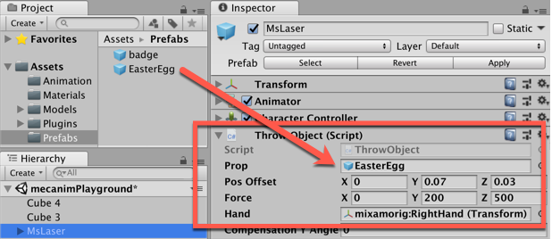

1. From the Project panel, select the Swat@toss_grenade asset file. In the Inspector, select Animation section, scroll down to the Events section, and expand this section.

1. Explore the animation preview panel, and see how as you drag the preview playhead along the preview Timeline, the playhead also moves correspondingly in the Events timeline. At the bottom of the Preview panel the time, (percentage), and Frame properties are displayed. When you click the add event button, a new Animation Event will be added in the Events Timeline at the current playhead position - so ensure you have the playhead at the correct frame before creating a new Animation Event.

    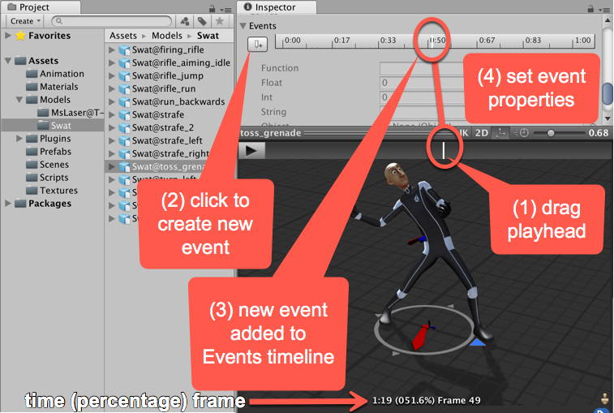

    NOTE: You may view looking at the avatar animation itself when moving the playhead, and visually choosing the appropriate frame when the character is the desired position for the event. Or you may already know the time / percentage / frame number at which you wish the Animation Event to be created - and so be looking at the numerical values at the bottom of the Preview panel.

1. Create two Animation Events in the Events section as follows:

    - 017.9%: set Function to Prepare

    - 057.1%: set Function to Throw.

    - Then click the Apply button

    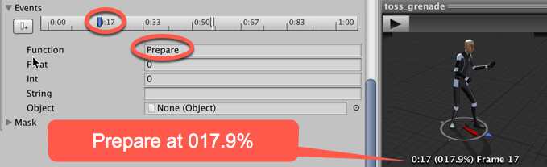

1. Play your scene. Your character will now be able to throw an Easter egg when you press the F key.

<!-- ******************************** -->
<!-- ******************************** -->

## How it works...

Once the toss_grenade animation reaches the moments that we have set our Events to, the Prepare() and Throw() methods are invoked.

Method Prepare() instantiates a prefab, now named projectile, into the character's hand (Projectile Offset values are used to fine-tune its position), also making it respect the character's hierarchy. Also, it disables the prefab's collider and destroys its Rigidbody component, provided it has one.

Method Throw() enables the projectile's collider, and adds a Rigidbody component to it, making it independent from the character's hand. Finally, it adds a relative force to the projectile's Rigidbody component, so it will behave as if thrown by the character. The Compensation YAngle can be used to adjust the direction of the grenade, if necessary.

<!-- ******************************* -->
<!-- ******************************* -->
<!-- ******** new recipe ********** -->
<!-- ******************************* -->
<!-- ******************************* -->

# Applying Ragdoll physics to a character

Action games often make use of Ragdoll physics to simulate the character's body reaction to being unconsciously under the effect of a hit or explosion. In this recipe, we will learn how to set up and activate Ragdoll physics to our character whenever she steps in a landmine object. We will also use the opportunity to reset the character's position and animations a number of seconds after that event has occurred.

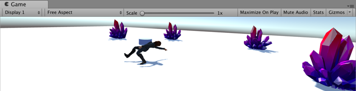

<!-- ******************************* -->
<!-- ******************************* -->

## Getting ready

For this recipe, we have prepared a Unity Package named Ragdoll, containing a basic scene that features an animated character, and a prefabs, already placed into the scene, named Spawnpoint. The files can be found in the 09_08 folder.


<!-- ******************************* -->
<!-- ******************************* -->

## How to do it...

To apply Ragdoll physics to your character, follow these steps:

1. Create a new 3D project and import: the Ragdoll Unity Package.

1. Open the mecanimPlayground level.

1. You will see the animated MsLaser character and two discs: Landmine and Spawnpoint.

1. First, let's create and set up our Ragdoll. Create a new 3D Ragdoll by choosing menu: Create | 3D Object | Ragdoll.... The Ragdoll wizard should pop-up.

1. Assign the transforms as follows:

    - Pelvis: mixamorig:Hips

    - Left Hips: mixamorig:LeftUpLeg

    - Left Knee: mixamorig:LeftLeg

    - Left Foot: mixamorig:LeftFoot

    - Right Hips: mixamorig:RightUpLeg

    - Right Knee: mixamorig:RightLeg

    - Right Foot: mixamorig:RightFoot

    - Left Arm: mixamorig:LeftArm

    - Left Elbow: mixamorig:LeftForeArm

    - Right Arm: mixamorig:RightArm

    - Right Elbow: mixamorig:RightForeArm

    - Middle Spine: mixamorig:Spine1

    - Head: mixamorig:Head

    - Total Mass: 20

    - Strength: 50

    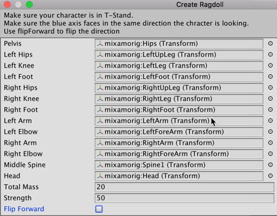

1. Select GameObject MsLaser in the Hierarchy. In the Inspector set its Tag to Player.

1. Create a new C# script-class named RagdollCharacter, and add an instance-object as a component to GameObject MsLaser:

    ```csharp
        using UnityEngine;
        using System.Collections;

        public class RagdollCharacter : MonoBehaviour {
        	private Transform spawnPoint;

        	void Start () {
        		spawnPoint = GameObject.Find("Spawnpoint").transform;
        	    DeactivateRagdoll();
            }

        	public void ActivateRagdoll() {
        		gameObject.GetComponent<CharacterController> ().enabled = false;
        		SetActiveRagdoll(true);
        		StartCoroutine (Restore ());
        	}

        	public void DeactivateRagdoll() {
        		SetActiveRagdoll(false);
        		RespawnPlayer();
        		gameObject.GetComponent<CharacterController>().enabled = true;
        	}

        	IEnumerator Restore() {
        		yield return new WaitForSeconds(5);
        		DeactivateRagdoll();
        	}

        	public void SetActiveRagdoll(bool isActive) {
        		gameObject.GetComponent<CharacterController> ().enabled = !isActive;
        		gameObject.GetComponent<BasicController> ().enabled = !isActive;
        		gameObject.GetComponent<Animator> ().enabled = !isActive;

        		foreach (Rigidbody bone in GetComponentsInChildren<Rigidbody>()) {
        			bone.isKinematic = !isActive;
        			bone.detectCollisions = isActive;
        		}

        		foreach (CharacterJoint joint in GetComponentsInChildren<CharacterJoint>()) {
        			joint.enableProjection = isActive;
        		}

        		foreach (Collider col in GetComponentsInChildren<Collider>()) {
        			col.enabled = isActive;
        		}
        	}

        	private void RespawnPlayer() {
        		transform.position = spawnPoint.position;
        		transform.rotation = spawnPoint.rotation;
        	}
        }
    ```

1. This recipe needs something to collide with - create a GameObject named death-object. You could create a simple 3D Cube (menu: Create | 3D Object | Cube). However, any 3D object, with a Physics Collider, will be fine for the player's character to interact with.

    NOTE: It's more fun to have some visually interesting 3D Model to interactive with. When creating the screenshots for this recipe we used the high quality, low-poly, free Stilized Crystal assets from LowlyPoly from the Unity Asset Store as an example objects you might use to cause a ragdoll collision in a game:

    https://assetstore.unity.com/packages/3d/props/stylized-crystal-77275

    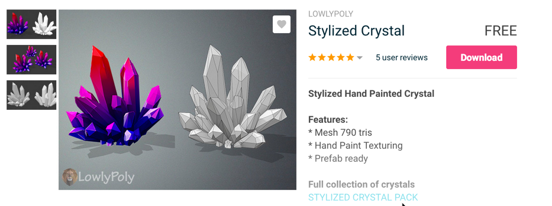

1. Create a new C# script-class named DeadlyObject, and attached an instance-object as a component to GameObject death-object:

    ```csharp
        using UnityEngine;

        public class DeadlyObject : MonoBehaviour {
        	public float range = 2f;
        	public float force = 2f;
        	public float up = 4f;

        	void OnTriggerEnter(Collider hit) {
        		if (hit.CompareTag("Player")) {
        			RagdollCharacter ragdollCharacter = hit.gameObject.GetComponent<RagdollCharacter>();
        			ExplodePlayer(ragdollCharacter);
        			Destroy(gameObject);
        		}
        	}

        	private void ExplodePlayer(RagdollCharacter ragdollCharacter) {
        		ragdollCharacter.ActivateRagdoll();
        		Vector3 explosionPos = transform.position;
        		Collider[] colliders = Physics.OverlapSphere(explosionPos, range);

        		foreach (Collider collider in colliders) {
        			if (collider.GetComponent<Rigidbody>())
        				collider.GetComponent<Rigidbody>().AddExplosionForce(force, explosionPos, range, up);
        		}
            }
        }
    ```

1. Play the scene. Using the WASD keyboard control scheme, direct the character to the death-object GameObject. Colliding with it will activate the character's Ragdoll physics and apply an explosion force to it. As a result, the character will be thrown away to a considerable distance and will no longer be in the control of its body movements, akin to a ragdoll.

<!-- ******************************** -->
<!-- ******************************** -->

## How it works...

Unity's Ragdoll Wizard assigns, to selected transforms, the components Collider, Rigidbody, and Character Joint. In conjunction, those components make Ragdoll physics possible. However, those components must be disabled whenever we want our character to be animated and controlled by the player. In our case, we switch those components on and off using the RagdollCharacter script and its two functions: ActivateRagdoll() and DeactivateRagdoll(), the latter includes instructions 
to re-spawn our character in the appropriate place.

For the testing purposes, we have also created the DeadlyObject script, which calls RagdollCharacter script's function named ActivateRagdoll(). It also applies 
an explosion force to our ragdoll character, throwing it outside the explosion site.


<!-- ******************************** -->
<!-- ******************************** -->

## There's more...

Here are some ways to go further with this recipe.

<!-- ******************************** -->
<!-- ******************************** -->

## New player GameObject rather than de-activating and moving to respawn point

Instead of resetting the character's transform settings, you could have destroyed its GameObject and instantiated a new one over the respawn point using Tags. For an example of how to do this check Unity's documentation at:

- http://docs.unity3d.com/ScriptReference/GameObject.FindGameObjectsWithTag.html

<!-- ******************************* -->
<!-- ******************************* -->
<!-- ******** new recipe ********** -->
<!-- ******************************* -->
<!-- ******************************* -->

# Rotating the character's torso to aim a weapon

When playing a third-person character, you might want her to aim her weapon at some target that is not directly in front of her, without making her change her direction. In these cases, you will need to apply what is called a procedural animation, which does not rely on premade animation clips, but rather on the processing of other data, such as player input, to animate the character. In this recipe, we will use this technique to rotate the character's spine by moving the mouse, allowing for adjustments in the character's aim. We will also use this opportunity to cast a ray from the character's weapon and display a crosshair over the nearest object on target. Please note that this approach will work with the cameras standing behind the third-person controlled characters.

    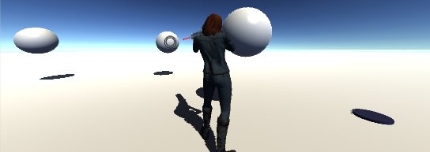

<!-- ******************************* -->
<!-- ******************************* -->

## Getting ready

For this recipe, we have prepared a Unity Package named AimPointer, containing a basic scene that features an animated character. The package, which also includes the crossAim sprite that is to be used as a crosshair for aiming, can be found inside the 09_09 folder.


<!-- ******************************* -->
<!-- ******************************* -->

## How to do it...

To Rotating the character's torso to aim a weapon, do the following:

1. Create a new project and import the AimPointer Unity Package.

1. Open the mecanimPlayground level. You will see an animated character named MsLaser holding the pointerPrefab object.

1. Create a new C# script-class named MouseAim, and add an instance-object as a component to GameObject MsLaser:

    ```csharp
        using UnityEngine;
        using System.Collections;

        public class MouseAim: MonoBehaviour  {
        	public Transform spine;
        	public Transform weapon;
        	public GameObject crosshairImage;
        	public Vector2 xLimit = new Vector2(-30f, 30f);
        	public Vector2 yLimit= new Vector2(-30f, 30f);
        	private float xAxis = 0f;
        	private float yAxis = 0f;

        	public void LateUpdate() {
        		RotateSpine();
        		ShowCrosshairIfRaycastHit();
        	}

        	private void RotateSpine() {
        		yAxis += Input.GetAxis("Mouse X");
        		yAxis = Mathf.Clamp(yAxis, yLimit.x, yLimit.y);
        		xAxis -= Input.GetAxis("Mouse Y");
        		xAxis = Mathf.Clamp(xAxis, xLimit.x, xLimit.y);
        		Vector3 newSpineRotation = new Vector3(xAxis, yAxis, spine.localEulerAngles.z);
        		spine.localEulerAngles = newSpineRotation;
        	}

        	private void ShowCrosshairIfRaycastHit() {
        		Vector3 weaponForwardDirection = weapon.TransformDirection(Vector3.forward);
        		RaycastHit hit;
        		Vector3 fromPosition = weapon.position + Vector3.one;
        		if (Physics.Raycast (fromPosition, weaponForwardDirection, out hit)) {
        			Vector3 hitLocation =  Camera.main.WorldToScreenPoint(hit.point);
        			DisplayPointerImage(hitLocation);
        		} else
        			crosshairImage.SetActive(false);
        	}

        	private void DisplayPointerImage(Vector3 hitLocation) {
        		crosshairImage.transform.position = hitLocation;
        		crosshairImage.SetActive(true);
        	}
        }
    ```

1. In the Hierarchy create a new UI Image named Image-crosshair, by choosing menu: Create | UI | Image.

1. In the Inspector for the Rect Transform component, set its Width and Height to 16, and populate Source Image field with the crossAim sprite.

    

1. Select the MsLaser GameObject in the Hierarchy, and in the Inspector for the Mouse Aim component, populate the followling:

    - Spine: mixamorig:Spine (in MsLaser | mixamorigHips)

    - Weapon: pointerPrefab (in MsLaser|Hips|Spine|Spine1|Spine2|RightShoulder|Arm|ForeArm|Hand)

    - Crosshair: GameObject Image-crosshair

    

1. Play the scene. You will now be able to rotate the character's torso by moving the mouse. Even better, the Image-crosshair UI image will be displayed at the top of the 
object that is being aimed at by the pointer.

<!-- ******************************** -->
<!-- ******************************** -->

## How it works...

You might have noticed that all the code for rotating the character's spine is inside the LateUpdate function, as opposed to the more common Update function. The reason for this is to make sure that all the transform manipulation will be executed after the original animation clip is played, overriding it.

Regarding the spine rotation, our script adds the horizontal and vertical speed of the mouse to the xAxis and yAxis float variables. These variables are then constrained within the specified limits, avoiding distortions to the character's model. Finally, the spine object transform rotation for x and y axes are set to xAxis and yAxis respectively. The z-axis is preserved from the original animation clip.

Additionally, our script uses a Raycast command to detect if there is any object's collider within the weapon's aim, in which case a crosshair will be drawn on the screen.


<!-- ******************************** -->
<!-- ******************************** -->

## There's more...

Here are some ways to go further with this recipe.

<!-- ******************************** -->
<!-- ******************************** -->

## Generic solution for Cameras other than Main Camera
Since this recipe's script was tailored for cameras standing behind the third-person controlled characters, we have included a more generic solution to the problem—in fact, a similar approach to the one presented in Unity 4.x Cookbook, Packt Publishing.

An alternate script named MouseAimLokkAt, which can be found inside the 09_09 folder, starts by converting our bi-dimensional mouse cursor screen's coordinates to the three-dimensional world space coordinates (stored in a point variable). Then, it rotates the character's torso towards the point location, using the LookAt() command to do so. Additionally, it makes sure that the spine does not extrapolate minY and maxY angles, otherwise causing distortions to the character model.

Also, we have included a Compensation YAngle variable that makes it possible for us to fine-tune the character's alignment with the mouse cursor. Another addition is the option to freeze the X-axis rotation, in case you just want the character to rotate the torso laterally, but not look up or down. Again, this script uses a Raycast command to detect objects in front of the weapon's aim, drawing a crosshair on the screen when they are present.


<!-- ******************************* -->
<!-- ******************************* -->
<!-- ******** new recipe ********** -->
<!-- ******************************* -->
<!-- ******************************* -->

# Creating geometry with Probuilder

A recent addition to the 3D Unity tools is Probuilder, which allows you to create and manipulate geometry inside the 
Unity Editor. Much more powerful than the existing Terrain editor, Probuilder allows you to create 3D Primitives, and
 then manipulate them, e.g. by extruding, or moving Vertices, Edges or Faces, and then painting with colors, or 
 Texturing with Materials.

In this recipe we'll create some Geometry that might be useful for an original game, or to add to a 3DGamekit Scene 
(such as worked with in the recipe following this one).

<!-- ******************************* -->
<!-- ******************************* -->

## Getting ready

This recipe uses the free Unity Asset Store and Package Manager packages.

<!-- ******************************* -->
<!-- ******************************* -->

## How to do it...

To create a platform game with Tiles and Tilemaps, follow these steps:

1. Create a new Unity 3D project.

1. Use the Package Manager to install the following packages (required by the 3D GameKit):

    - Cinemachine

    - Post Processing

    - Probuilder

1. Import 3D GameKit (free from Unity Technologies) from the Asset Store.

    


1. Agree to the Quality Settings popup diaglog. After a few minutes (it is setting up a prject with _lots_ of assets), you'll see a new folder in the Project panel named 3DGamekit.

1. Close and then re-open the Unity Editor.

1. First, open the provided example Scene and explore the 3D world controlling the 3D Ellen character.

    NOTE: Movement is standard WASD-SPACE/arraw-keys. Camera control is via the mouse pointer.

1. Create a new 3D GameKit Scene, by choosing menu: Kit Tools | Create New Scene. You'll then be asked to name the Scene, and a new Scene asset file will be created in your Project | Assets folder. You'll see there are quite a few special GameObjects in the Hierarchy of your new Scene:

    

1. As you can see, the new Scene starts off containing an animated 3D character (Ellen), on a ProBuilder 3D Plane forming the ground she is standing on.

1. Add a small door in the Scene. Drag a clone of Prefab DoorSmall from the Project panel (Assets | 3DGamekit | Prefabs | Interactables) in the middle of the 3D Plane Scene.

1. Add a Crystal in the Scene, on the opposite side of the door from where the Ellen character starts. Drag a clone of Prefab Crystal from the Project panel (Assets | 3DGamekit | Prefabs | Interactables) into the Scene behind the door.

1. Now add some walls on either side of the door - so the door must be opened in order for Ellen to reach the Crystal. Drag 2 clones of Prefab Wall2x from the Project panel (Assets | 3DGamekit | Prefabs | Interactables) into the Scene.

    

1. We now need to connect the PressurePad to the Door, so when Ellen steps on the PressurePad it sends a mesage to 
Open the door. This is very straightforward, since the Door has a GameCommandReceiver component, which can be linked 
to the PressurePad's Send on Trigger Enter (Script) component. Select the PressurePad GameObject in the Hierarchy, 
and drag DoorSmall into the public Interactive Object slot of its Send on Trigger Enter (Script) component.

    

1. Run the Scene. When Ellen steps onto the PressurePad the Door should open.

1. We now need to make the Crystal collidable by adding a Box Collider. Add a Box Collider component to GameObject 
Crystal, and check its On Trigger option.

1. The 3DGamekit has inventory features. Let's make the Crystal collectable by the player by adding an Inventory Item
 (Script) component. In the Inspector cick Add Component, then type 'inven', and choose the Inventory Item scripted 
 component. For that component type Crystal as the name of the Inventory Key.
 
    

    NOTE: The Inventory Key names must match, between the Inventory Object and the Inventory slot.
 
1. Now we can add an Inventory Controller (Script) component to Ellen, with a slot for a Crystal. In the Hierarchy select GameObject Ellen. In the Inspector click Add Component, then type 'inven', and choose the Inventory Item scripted component. Change the Size 
from 0 to 1, and for its Key type Crystal. For the On Add() events click the plus sign +, to create a new event. Drag
 Ellen into the Object slot (below Runtime Only). Change the function from No Function to InventoryController Add 
 Item. Finally, type the name of this item in the Inventory to be Crystal.


    

1. Run the Scene. Ellen can now open the Door (via the PressurePad), and walk into the Crystal, which is added to her
 inventory.
 

<!-- ******************************** -->
<!-- ******************************** -->

## How it works...

xxxx
 

Learn more about Probuilder:

    - Unity Technology Probuilder videos:

        - https://www.youtube.com/user/Unity3D/search?query=Probuilder


<!-- ******************************* -->
<!-- ******************************* -->
<!-- ******** new recipe ********** -->
<!-- ******************************* -->
<!-- ******************************* -->

# Creating a game with the 3D Gamekit

A collection of Unity 3D tools has been combined to become the Unity 3D GameKit. In this recipe we'll create a new 
Scene, and make use of some of the kits Preabs and Scripts to illustrate how characters can interactive with objects 
like doors and pickups.

<!-- ******************************* -->
<!-- ******************************* -->

## Getting ready

This recipe uses the free Unity Asset Store and Package Manager packages.

<!-- ******************************* -->
<!-- ******************************* -->

## How to do it...

To create a platform game with Tiles and Tilemaps, follow these steps:

1. Create a new Unity 3D project.

1. Use the Package Manager to install the following packages (required by the 3D GameKit):

    - Cinemachine

    - Post Processing

    - Probuilder

1. Import 3D GameKit (free from Unity Technologies) from the Asset Store.

    


1. Agree to the Quality Settings popup diaglog. After a few minutes (it is setting up a prject with _lots_ of assets), you'll see a new folder in the Project panel named 3DGamekit.

1. Close and then re-open the Unity Editor.

1. First, open the provided example Scene and explore the 3D world controlling the 3D Ellen character.

    NOTE: Movement is standard WASD-SPACE/arraw-keys. Camera control is via the mouse pointer.

1. Create a new 3D GameKit Scene, by choosing menu: Kit Tools | Create New Scene. You'll then be asked to name the Scene, and a new Scene asset file will be created in your Project | Assets folder. You'll see there are quite a few special GameObjects in the Hierarchy of your new Scene:

    

1. As you can see, the new Scene starts off containing an animated 3D character (Ellen), on a ProBuilder 3D Plane forming the ground she is standing on.

1. Add a small door in the Scene. Drag a clone of Prefab DoorSmall from the Project panel (Assets | 3DGamekit | Prefabs | Interactables) in the middle of the 3D Plane Scene.

1. Add a Crystal in the Scene, on the opposite side of the door from where the Ellen character starts. Drag a clone of Prefab Crystal from the Project panel (Assets | 3DGamekit | Prefabs | Interactables) into the Scene behind the door.

1. Now add some walls on either side of the door - so the door must be opened in order for Ellen to reach the Crystal. Drag 2 clones of Prefab Wall2x from the Project panel (Assets | 3DGamekit | Prefabs | Interactables) into the Scene.

    

1. We now need to connect the PressurePad to the Door, so when Ellen steps on the PressurePad it sends a mesage to 
Open the door. This is very straightforward, since the Door has a GameCommandReceiver component, which can be linked 
to the PressurePad's Send on Trigger Enter (Script) component. Select the PressurePad GameObject in the Hierarchy, 
and drag DoorSmall into the public Interactive Object slot of its Send on Trigger Enter (Script) component.

    

1. Run the Scene. When Ellen steps onto the PressurePad the Door should open.

1. We now need to make the Crystal collidable by adding a Box Collider. Add a Box Collider component to GameObject 
Crystal, and check its On Trigger option.

1. The 3DGamekit has inventory features. Let's make the Crystal collectable by the player by adding an Inventory Item
 (Script) component. In the Inspector cick Add Component, then type 'inven', and choose the Inventory Item scripted 
 component. For that component type Crystal as the name of the Inventory Key.
 
    

    NOTE: The Inventory Key names must match, between the Inventory Object and the Inventory slot.
 
1. Now we can add an Inventory Controller (Script) component to Ellen, with a slot for a Crystal. In the Hierarchy select GameObject Ellen. In the Inspector click Add Component, then type 'inven', and choose the Inventory Item scripted component. Change the Size 
from 0 to 1, and for its Key type Crystal. For the On Add() events click the plus sign +, to create a new event. Drag
 Ellen into the Object slot (below Runtime Only). Change the function from No Function to InventoryController Add 
 Item. Finally, type the name of this item in the Inventory to be Crystal.


    

1. Run the Scene. Ellen can now open the Door (via the PressurePad), and walk into the Crystal, which is added to her
 inventory.
 

<!-- ******************************** -->
<!-- ******************************** -->

## How it works...

We have dipped our toes into the wide range of features of the 3D GameKit. Hopefully this recipe gives an idea of how
 to work with the provided Prefabs, and how 3DGamekit components could be added to custom GameObjects.
 
Learn more:

    - The 3DGamekit reference guide
    
        - https://unity3d.com/learn/tutorials/projects/3d-game-kit/introduction-3d-reference-guide?playlist=51061

    - The Unity 3DGamekit walkthrough pages:
    
        - https://unity3d.com/learn/tutorials/projects/3d-game-kit/introduction-walkthrough?playlist=51061
        
    - Download the 3DGameKit, including sample Scene, from the Asset Store:
    
        - https://assetstore.unity.com/packages/essentials/tutorial-projects/3d-game-kit-beta-115747?_ga=2.127077645.1823824032.1533576706-1834737598.1481552646
